This file contains the walkthrough for the challenge "Misprotected" part 1 and 2.

> [!WARNING]
> The binaries referenced in this walkthrough are not the same as those that will be distributed to participants. As a result, the specific addresses and offsets noted here are for reference only and will not align exactly with the binaries provided during the competition.
## Part 1

This part is deliberately made easy. The code relevant to this part can be analyzed statically since it is not virtualized or mutated.

The "authorization code" mechanism is essentially a serial number verified with VMProtect SDK's `VMProtectGetSerialNumberState` function. VMProtect's obfuscations are most likely too sophisticated to break within the amount of time available, so participants will need to find another way.

Pretty much all of the functions in the `MainWindow` class are protected with VMProtect's `Ultra` configuration, which is virtualization + mutation. They will be too difficult to analyze. However, the serial number validation logic lives unprotected in the authentication dialog's code, allowing easy manipulation of the dialog's return status.

When you enter the wrong authorization code in the dialog, you will see this error message:

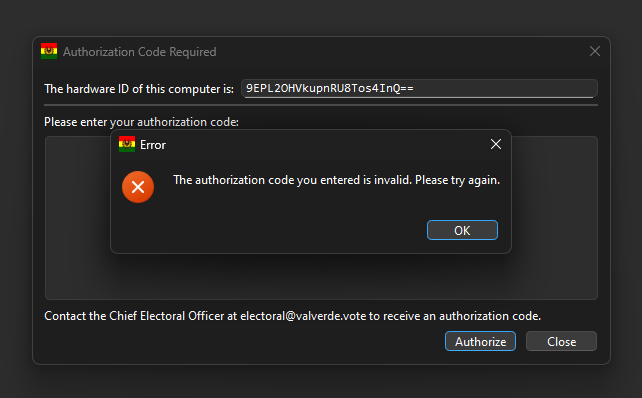

Since both the string and the function are unprotected, you should be able to find this string and see what accesses this string in static analysis:

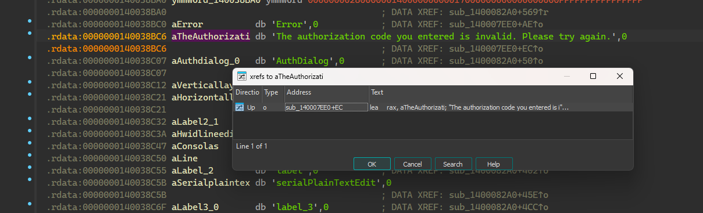

We can see that the code checks if `edi` is `0` here. It's pretty easy to tell that if `edi` isn't `0`, it will call some functions and pass that error message as an argument, so we can assume we want `edi` to be `0` here, which means that the serial number is valid.

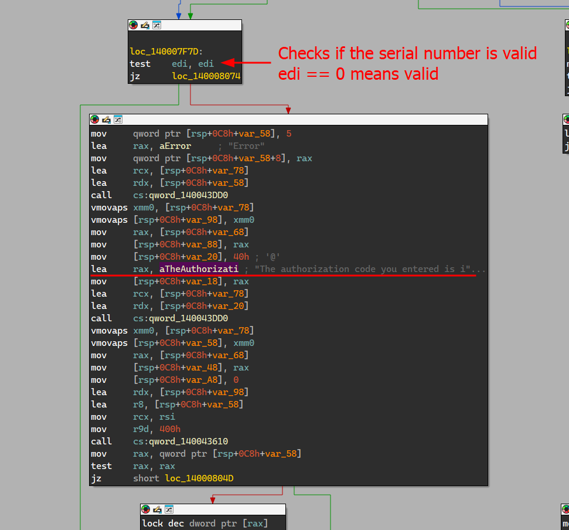

If you try to patch this jump in the binary on the disk, the program will refuse to launch because VMProtect's `Mmeory Protection` feature checks the integrity of the file before passing the control to the original program:

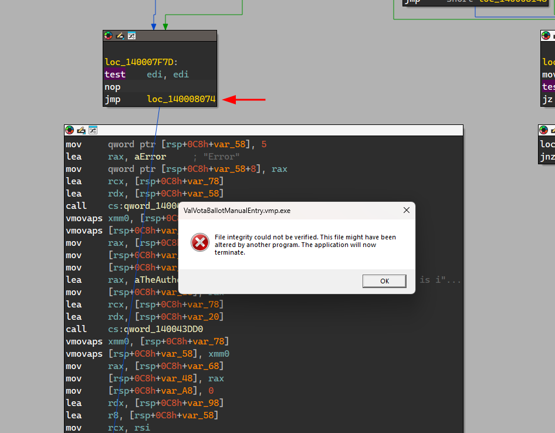

Patching the program in-memory when it's already running also triggers an error since the program calls VMProtect SDK's `VMProtectIsValidImageCRC` function to check for the file image's integrity when it verifies the validity of the serial number:

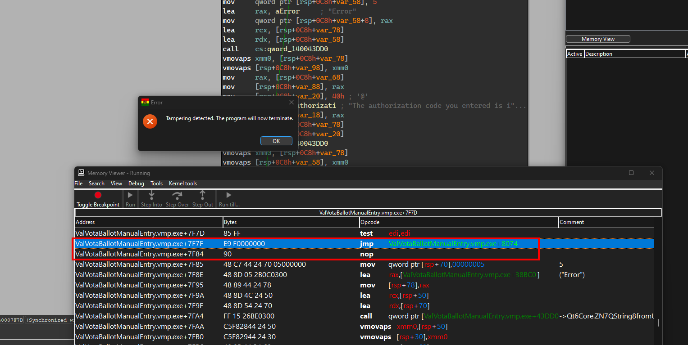

Instead, we can attach a debugger to the program and manipulate the value of the `edi` register. However, if we attach a regular Windows Debugger, the program will also detect it and exit since it uses VMProtect SDK's `VMProtectIsDebuggerPresent` function to detect the presence of debuggers.

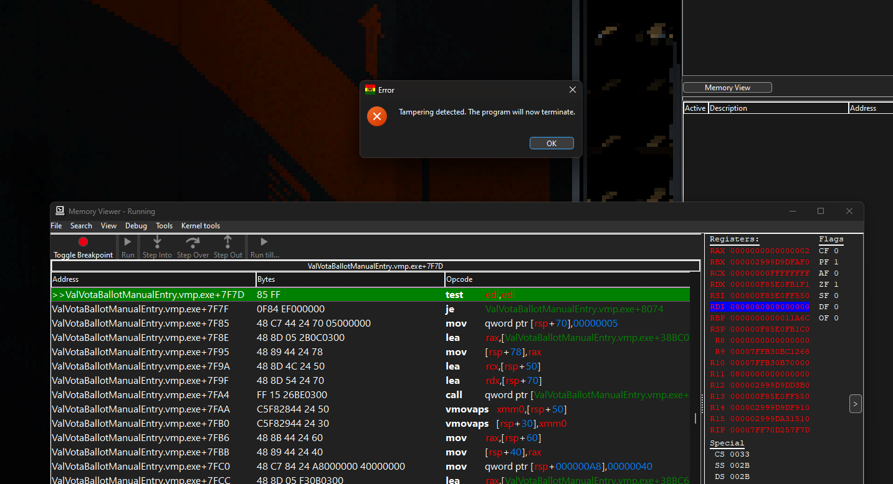

We can combat this by using a debugger that's more covert. Here I'm using a custom-compiled Cheat Engine DBVM kernel mode debugger. For the stock version of Cheat Engine, the kernel mode debugger will get detected, but not the user-mode VEH debugger or the DBVM-level (ring -1) debugger. Other debuggers such as HyperDbg could work too.

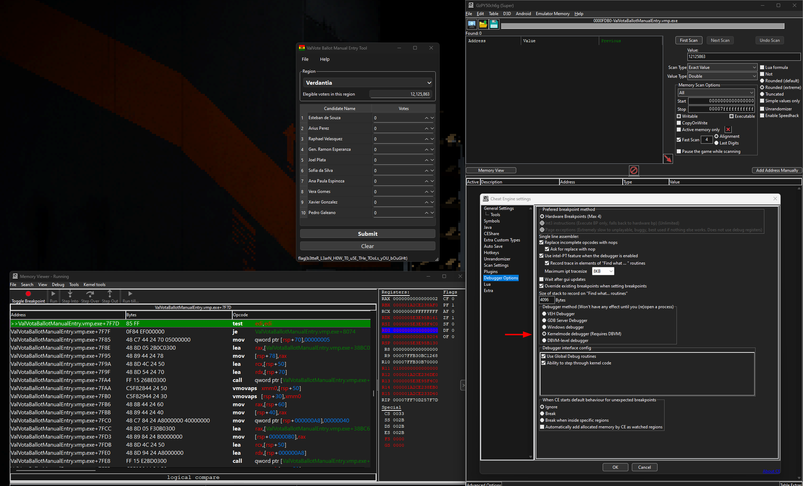

The flag is shown on the status bar once we enter the "homepage" of the application.

## Part 2

When we enter votes that sums up to be higher than the number of eligible voters in the selected region, this error message pops up:

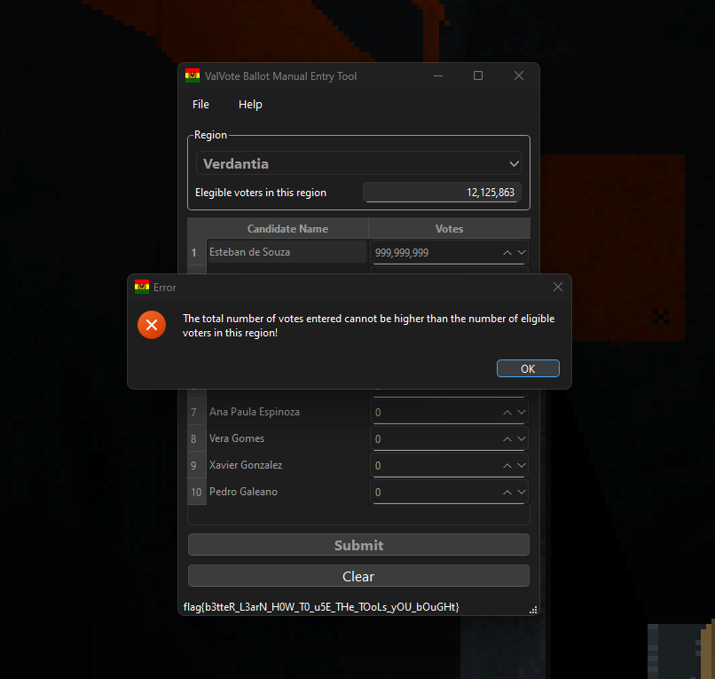

This string cannot be found with static analysis in the program like in the previous part because it has been encrypted by VMProtect. All the code associated with this part of the challenge are also protected with VMProtect's `Ultra` configuration (virtualization + mutation), so it is not practical to statically analyze what's going on behind this error message.

There are many more ways to solve this challenge such as reverse engineering the gRPC ProtoBuf specs and manipulating the data or forging your own requests. I will walk you through the simplest solution, which is to find and patch the number of eligible voters in-memory.

We need to search the memory to find out where the number of eligible voters for each region are stored. Before we can perform the search, we will first need to determine the numbers' data type, and this part may trick some people.

You may assume that these numbers are integers because that is the natural thing to do, but they are actually `double`s. If you examine the import table of the program, you'll see that it only uses `QDoubleSpinBox` instead of `QSpinBox`. This is a clue that all of the numbers you see are `double`s, so you should search for `12125863` with the `double` data type. (This is also the reason why I turned off VMProtect's `Import Protection` feature.)

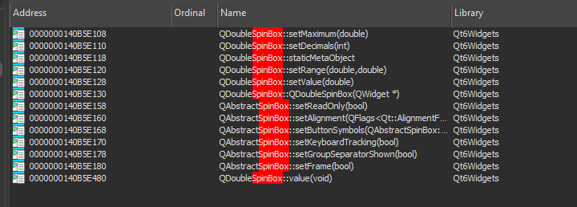

We can search for the number `12125863` in Cheat Engine. There should only be three results including the number in the read-only section. However, when we try to change the number that is used to perform the checks, we will get an error, and the application closes:

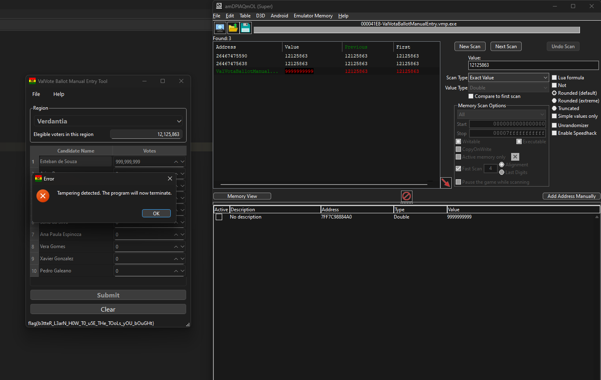

This is because the application performs an image integrity check as it returns the number of voters for a region. We can use a stealthy debugger to check what is reading this data and alter the readouts in the debugger instead. It should be noted that while the user-mode VEH debugger works for the first part of this challenge, it will not work for this part. You will either need to use a custom DBK driver's kernel-mode debugger, the DBVM-level debugger, or an equivalent debugger that's more stealthy than the VEH debugger.

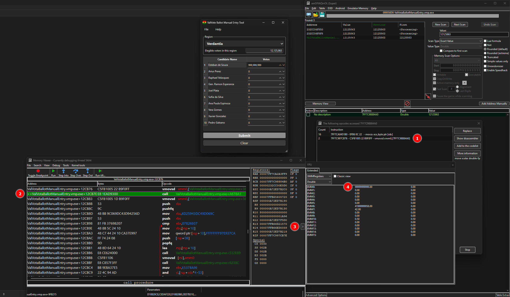

Then we can continue the execution and the the number we entered will pass the checks. The server will do the math and return the flag:

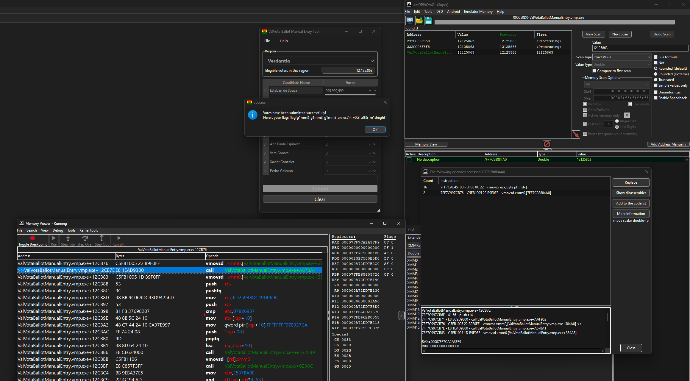
